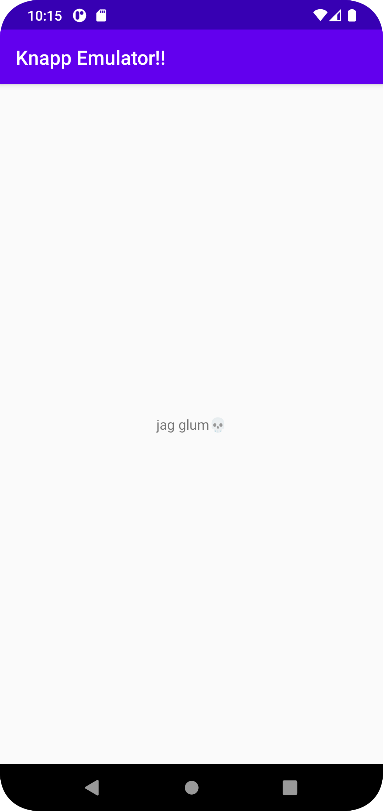

# Rapport

- Add a second activity
  Jag la till en andra aktivitet genom att högerklicka på mappen där första aktiviteten ligger och sedan skapade en tom aktivitet.
  
- Add a button in the first activity that starts the second activity
  Jag la till en knapp genom att gå in i "design" läget och sedan drog en knapp under constraint layouten som fanns. Därefter sattes constraints på knappen för att 
  positionera den ordentligt. Dessa constraints sattes mot texten som fanns ovan med hjälp av ID.
  
```
  app:layout_constraintTop_toBottomOf="@+id/btnText"
  app:layout_constraintStart_toStartOf="@+id/btnText"
  app:layout_constraintEnd_toEndOf="@+id/btnText"
``` 

- Add data to the intent bundle using extras
  För att lägga till min data i den intent som skapades användes en putExtra. I denna putExtra skickades "string" samt meddelandet med den intent som fanns.
  
```
  intent.putExtra("String", msg);
```
- In the layout of in the second activity add least one widget to show data from the intent
  För att kunna visa datan som skickas med den intent som finns används en textView. I förstahand hämtar texten ett ID från "textView". Därefter används setText
  och hämtar datan från intent samt putExtra. Därefter visas texten som finns med i tidigare skapad intent.
  
```
  TextView txt;

  txt = findViewById(R.id.textView);
  txt.setText(getIntent().getStringExtra("String"));
``` 


